# Helix like vim config

> helix is a wonderful project, but it starts slow, so I want to use vim for instead.

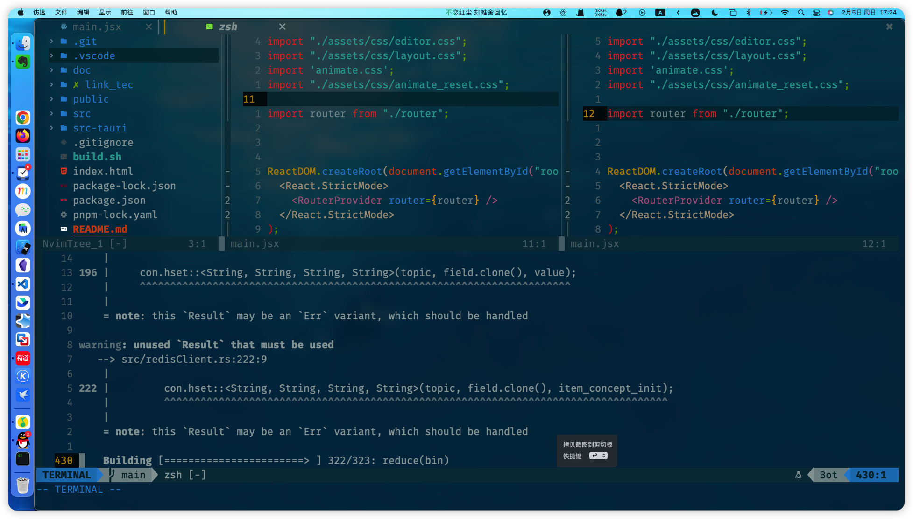
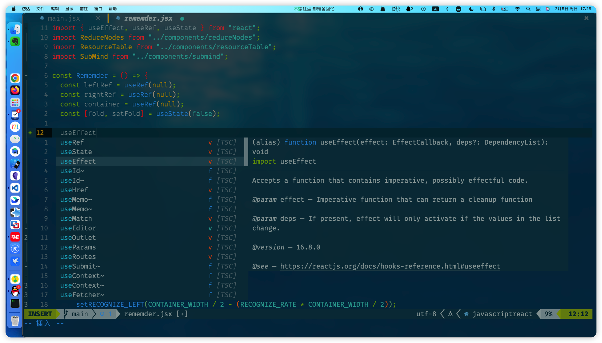
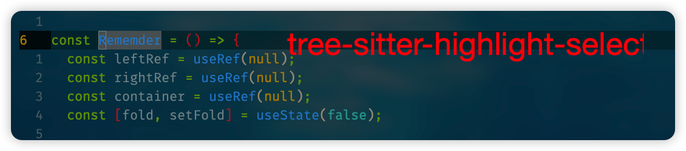
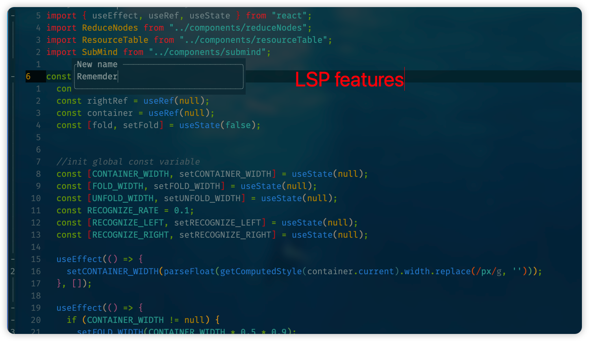
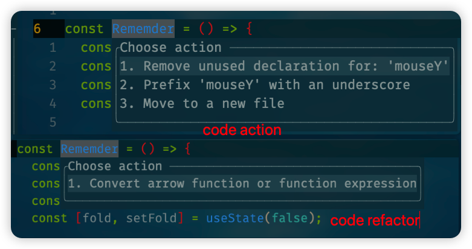
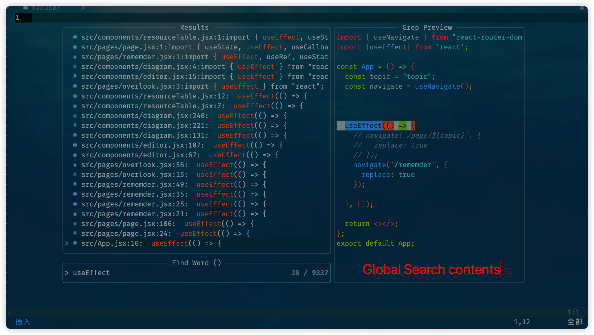
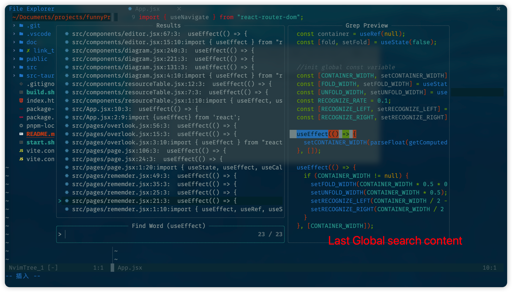
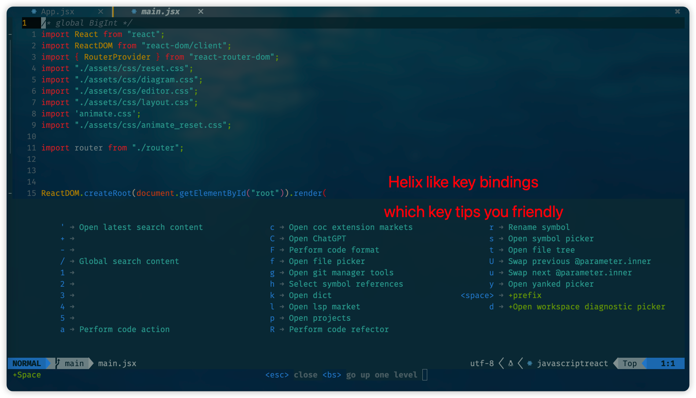
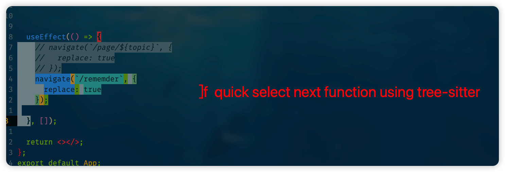
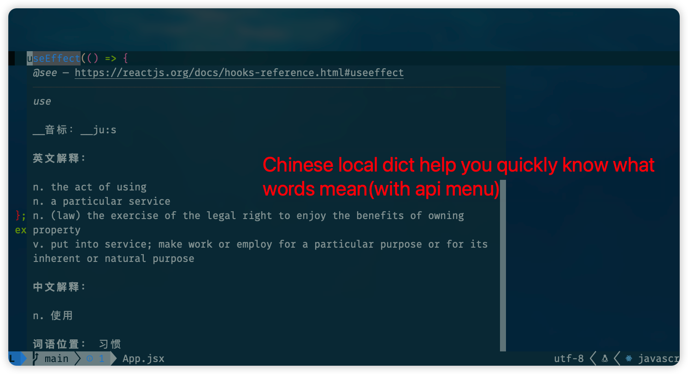
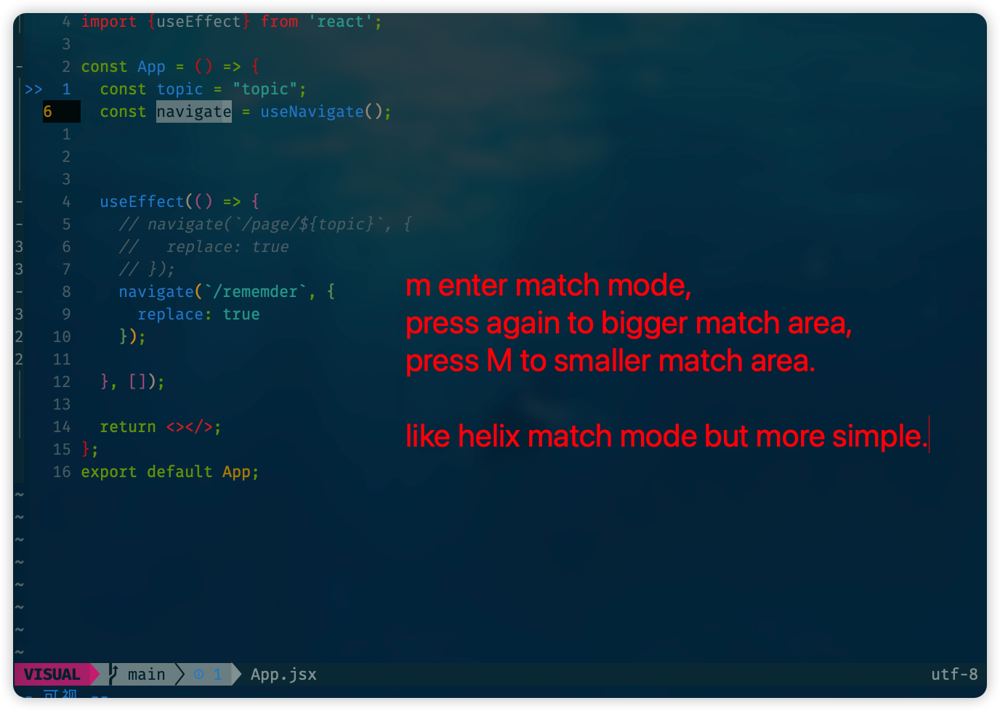
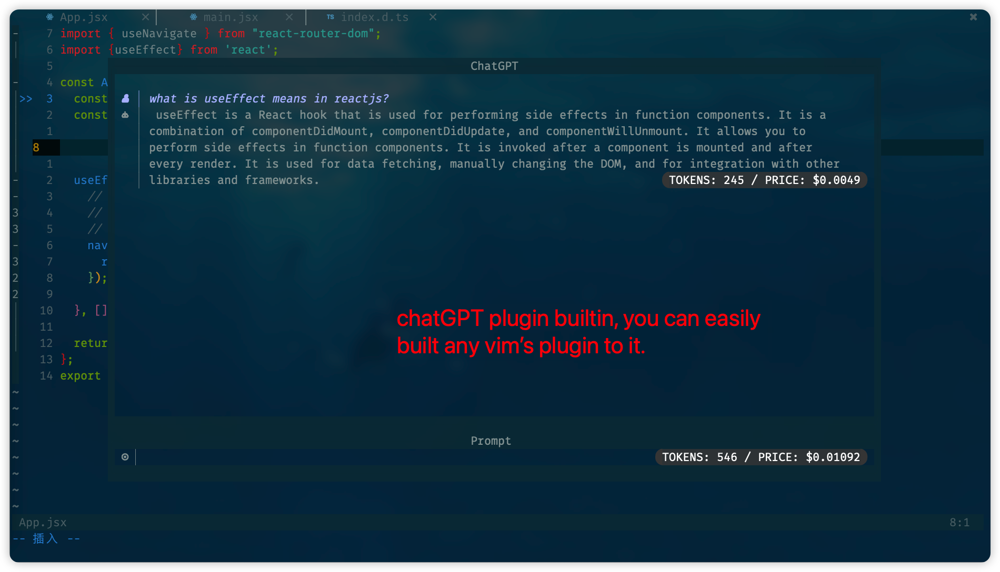
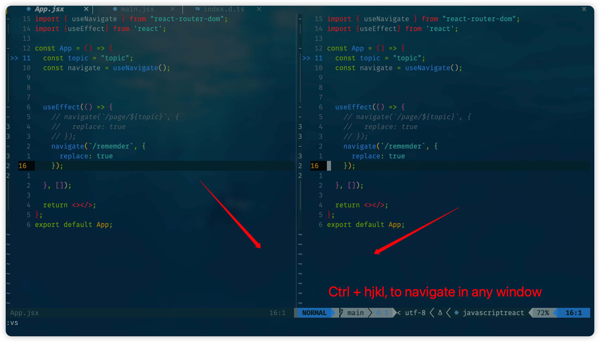
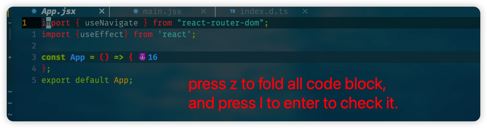
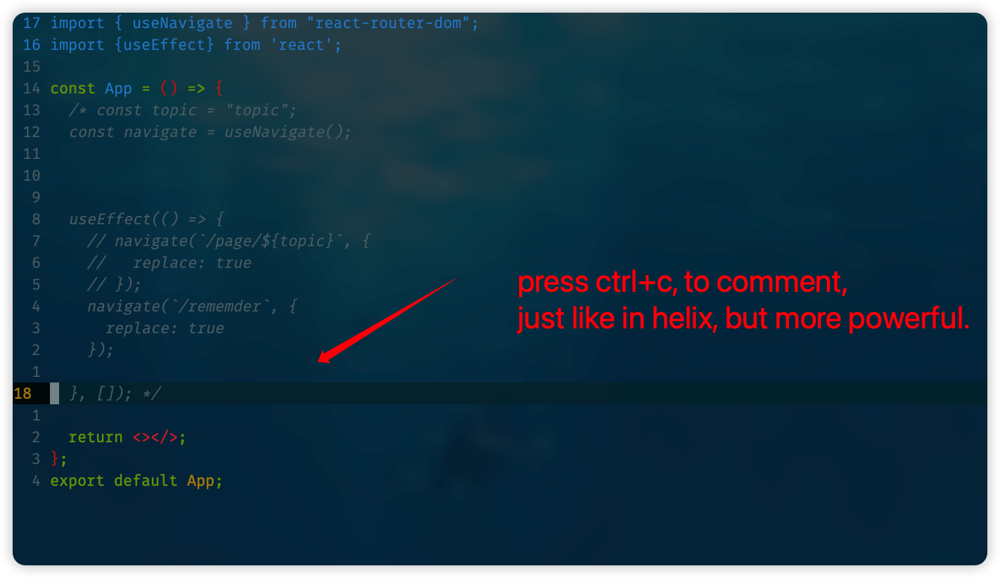
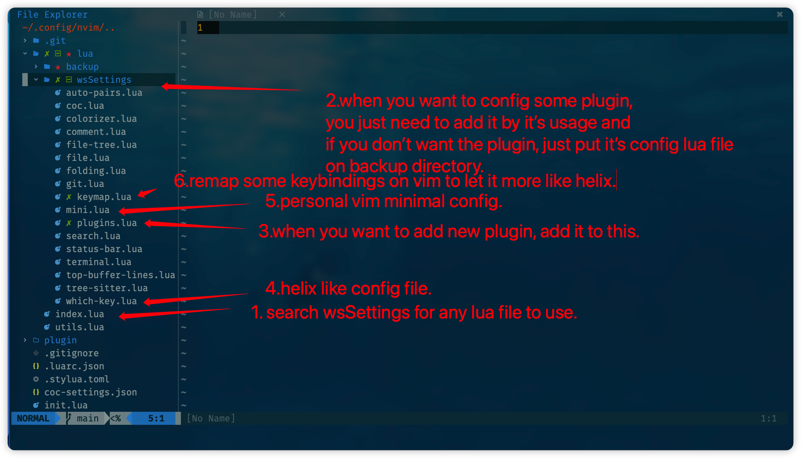

# the terminal I use

I use Iterm2 on macos, here are my configration.

